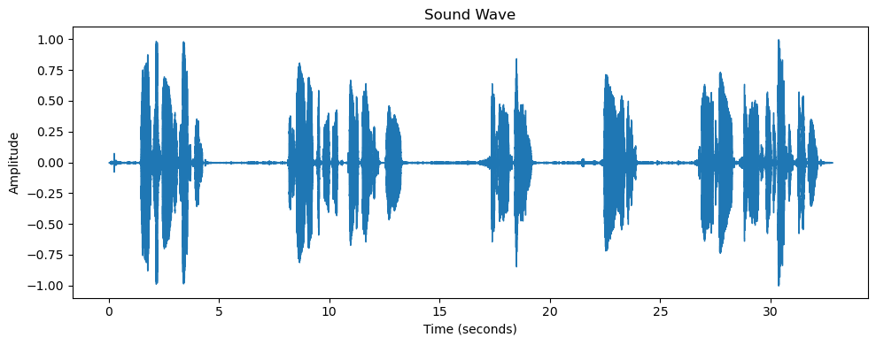
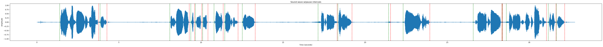
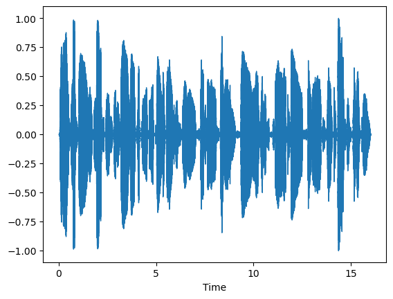
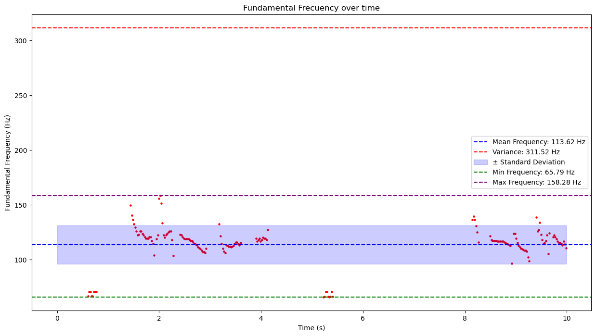
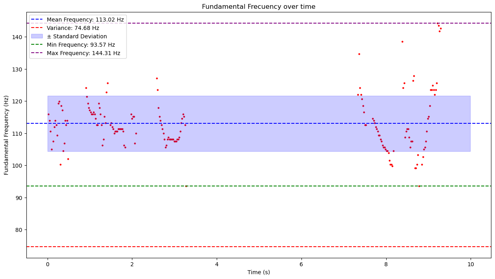
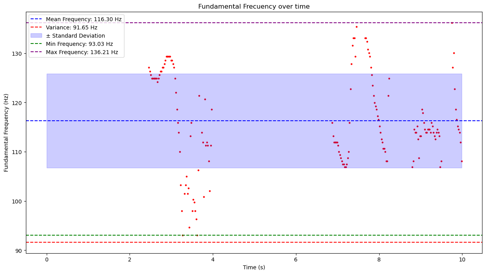
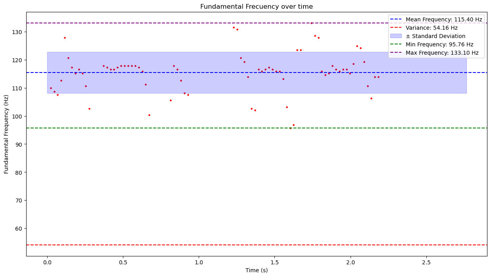
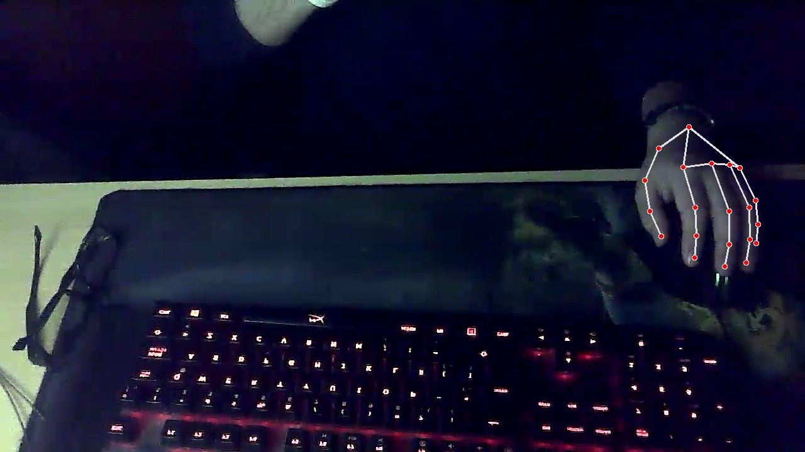
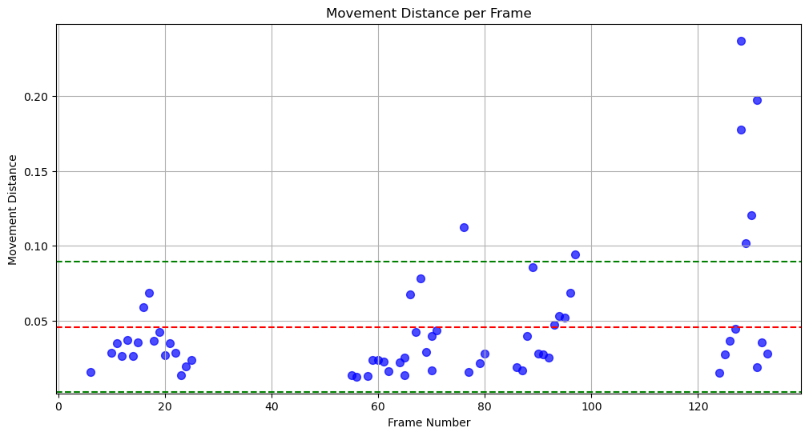
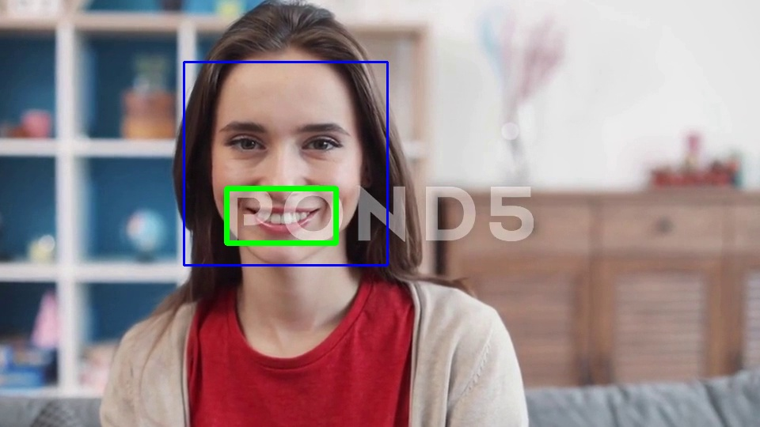

# oratory-lab

## Dependencies

- Librosa: Audio analyzer
- Matplotlib: Visualization of different types of graphics.
- Numpy: For a more efficient array manipulation in different dimensions.
- Mediapipe: Ease AI & ML solutions
- Cv2: Ease AI & ML pre-trained classifiers, such as 'haarcascades'

`pip install librosa matplotlib numpy Ipython mediapipe`
`conda install -c conda-forge opencv`

> NOTE: It can be tested locally in Jupyter Notebook or Ipython interactive shell. Or simply do it in Google Colab if you are more familiar with it.

## Overall description

**_Each Jupyter Notebook file has its explication process as well as related images. Thus, for more information, I suggest checking these files on your own_**

These labs are a 'reproduced' research and implementation of a few features of my Final Project career. Although there were more analyzers, such as eye, voice force, and so on... this 'lab' only had a small part of the production code the project had.

Due to time constraints, the models were all pre-trained, these models came from OpenCV & MediaPipe. Although a Logistic Regression function is discussed in [silence_detector file](https://github.com/peyk0v/oratory-lab/blob/main/verbal/silence_detector.ipynb).

### Silence Detector

Link: [silence_detector](https://github.com/peyk0v/oratory-lab/blob/main/verbal/silence_detector.ipynb).

In this Ipython Notebook intervals of silents are detected by a threshold estimation and then truncated to generate a new audio without those silents.

### Frequency Variability

Link: [frequency_variability](https://github.com/peyk0v/oratory-lab/blob/main/verbal/frequency_variability.ipynb).

Based on the audio, we calculate the fundamental frequency, separate the audio into segments of 10 seconds, and then visualize the frequency variability in relation to _mean frequency_ value of that segment.

### Hand movement Detector

Link: [hand_movement_detector](https://github.com/peyk0v/oratory-lab/blob/main/non-verbal/hand_movement_detector.ipynb)

In this video analyzer, hands movements are calculated based on the position of each hand point in relation to its next frame. If there were movement, then the positions should move.

> Due to position detection precision issues, a threshold is used in order to discard those movements made by the recalculation of each frame.

MOVEMENT DETECTED IN FRAME #6 | MOVEMENT DISTANCE: 0.01543724536895752  
MOVEMENT DETECTED IN FRAME #10 | MOVEMENT DISTANCE: 0.028378725051879883  
MOVEMENT DETECTED IN FRAME #11 | MOVEMENT DISTANCE: 0.035067081451416016  
MOVEMENT DETECTED IN FRAME #12 | MOVEMENT DISTANCE: 0.025989890098571777  
MOVEMENT DETECTED IN FRAME #13 | MOVEMENT DISTANCE: 0.03673309087753296  
MOVEMENT DETECTED IN FRAME #14 | MOVEMENT DISTANCE: 0.02635437250137329  
MOVEMENT DETECTED IN FRAME #15 | MOVEMENT DISTANCE: 0.03543651103973389  
MOVEMENT DETECTED IN FRAME #16 | MOVEMENT DISTANCE: 0.05904221534729004  
MOVEMENT DETECTED IN FRAME #17 | MOVEMENT DISTANCE: 0.06874048709869385  
MOVEMENT DETECTED IN FRAME #18 | MOVEMENT DISTANCE: 0.036192119121551514  
MOVEMENT DETECTED IN FRAME #19 | MOVEMENT DISTANCE: 0.04202401638031006  
MOVEMENT DETECTED IN FRAME #20 | MOVEMENT DISTANCE: 0.026770174503326416  
MOVEMENT DETECTED IN FRAME #21 | MOVEMENT DISTANCE: 0.034870445728302  
...

### Smile Detector

Link: [smile_detector](https://github.com/peyk0v/oratory-lab/blob/main/non-verbal/smile_detector.ipynb)

Here is where `haarcascades` are used. These pre-trained classifiers can be adjusted by two parameters:

- scaleFactor: to scale the image keeping in mind the image/cam resolution
- minNeighbors: the 'sensibility' of the detection, there must be these minimum neighbors to classifier the face/smile as one.

